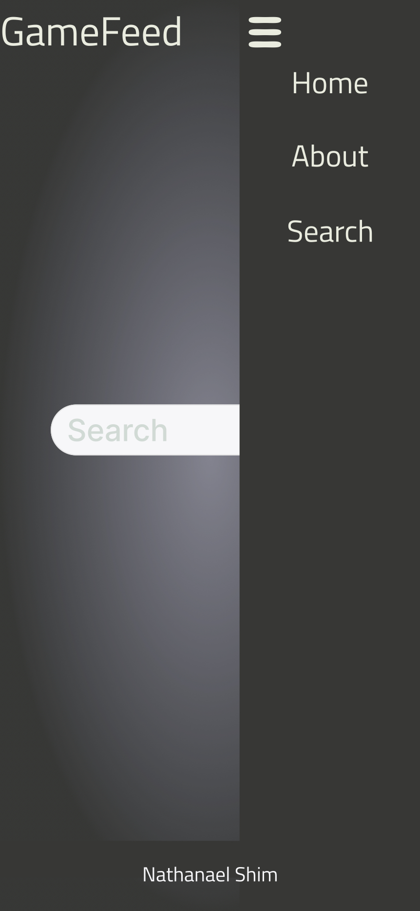
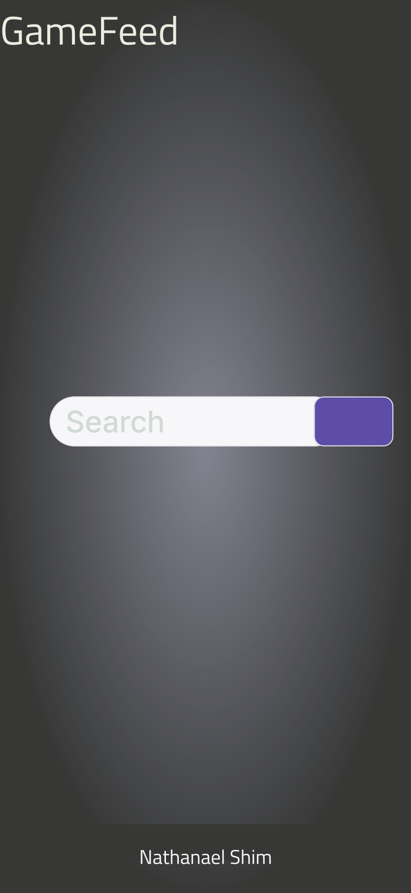
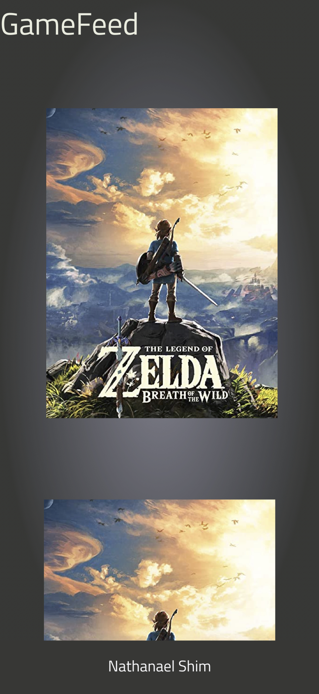
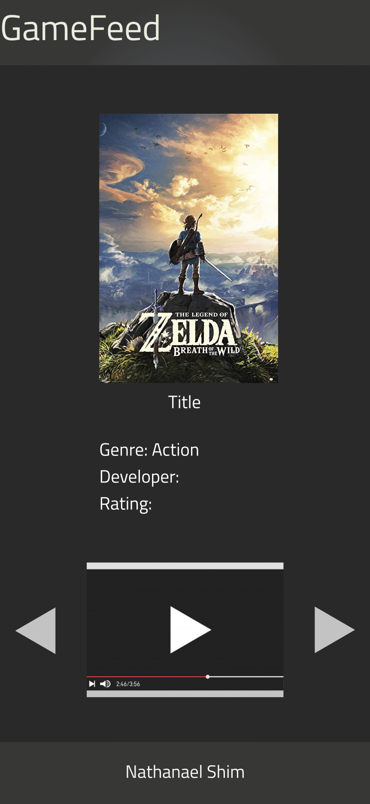

# Project Overview

## Project Name
---
GameFeed

## Project Description
---
Web application for discovering new games based on player preferences of genre, cost, development companies, ratings, and more.

## API
---
I am using [IDGB API](https://api-docs.igdb.com/#about) to extract the list of recommended games. I will also be extracting a list of genres, costs, and other categories that will be then rendered on the frontend so that the player will be able to submit their preferences.

## API Snippet
---
```
axios.get('https://api.igdb.com/v4/games', {
  headers: {
    Client-ID: clientID,
    Authorization: "Bearer " + access_token,
  },
  params: {
    fields: "name",
  }
})
```
```
[
  {
    "id": 90269,
    "name": "Nuclear 2050"
  },
  {
    "id": 40104,
    "name": "Dogou Souken"
  },
  {
    "id": 24037,
    "name": "Three Digits"
  },
  {
    "id": 41825,
    "name": "The Legend of Zelda: Breath of the Wild - The Master Trials"
  },
  {
    "id": 68841,
    "name": "Captivus"
  },
  {
    "id": 33284,
    "name": "One way to exit"
  },
  {
    "id": 104748,
    "name": "Space station - build your own ISS"
  },
  {
    "id": 146815,
    "name": "Parking Lot Maze"
  },
  {
    "id": 85450,
    "name": "Transformers Prime: The Game"
  },
  {
    "id": 89616,
    "name": "Bubble Whirl Shooter"
  }
]
```

## Wireframes
---







## MVP

* Create HTML/CSS/JavaScript for user interface to query search and display results
* Axios calls to IDGB API to extract all relevant data
* Implement responsive design

### Post-MVP
* Add more options for user to narrow down search such as letting them submit a list of favorite games and creating an informed search with the games provided as reference
* Implement animations and other UI/UX enhancements

#### Post-post-MVP
---
* User profiles and user authentication 

## Project Schedule
---

|Day| Deliverable| Status |
|-      |:--:|   -:|
|8/30/21| Project Approval/Backend | Pending |
|8/31/21| Backend/Frontend | Pending |
|9/1/21| Frontend/Styling | Pending |
|9/2/21| Post-MVP Content | Pending |

## Priority Matrix
---


## Timeframes

|Component| Priority| Estimated Time | Time Invested | Actual Time |
|-        |  :--:   |  :--:          |   :--:        |           -:|
|Essential HTML|M|3hrs|TBD|TBD|
|Axios|H|3hrs|TBD|TBD|
|JS|H|3hrs|TBD|TBD|
|Essential CSS|L|3hrs|TBD|TBD|
|Responsive Behavior|H|3hrs|TBD|TBD|
|Extra/Decorative HTML|L|3hrs|TBD|TBD|
|Extra/Decorative CSS|L|3hrs|TBD|TBD|
|Post-MVP Content|M|3hrs|TBD|TBD|

